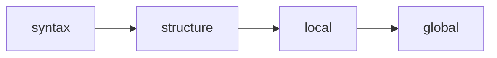

# Quality Control

Typedown provides a unified `check` command with four progressive validation stages. Each stage builds upon the previous, allowing you to trade speed for thoroughness based on your current workflow needs.

## Progressive Validation

The four stages form a pipeline where each stage is a superset of the previous:



### Stage 1: Syntax

The fastest check, parsing files without loading the Python environment.

```bash
typedown check syntax
```

Validates Markdown AST structure and YAML format correctness. Use during active editing when you need instant feedback on syntax errors.

### Stage 2: Structure

Loads models and instantiates entities without running validators.

```bash
typedown check structure
```

Ensures entities can be constructed from their raw data. This is a lightweight check for structural integrity. Use the `--fast` flag as a shortcut for syntax plus structure.

### Stage 3: Local

The default check level, running all Pydantic validators on individual entities.

```bash
typedown check
typedown check local
```

Executes field validators, model validators, and computed fields. Validates reference formats without resolving them. Ensures each entity is internally consistent. Suitable for pre-save validation in editors.

### Stage 4: Global

Full project validation including cross-entity reference resolution and spec execution.

```bash
typedown check global
typedown check --full
```

Resolves all references to verify they point to existing entities. Runs spec blocks for complex cross-entity rules. Use this before commits and builds. The `--full` flag runs all stages.

## Environment Isolation

Different stages are appropriate for different environments:

**Editor Integration**: Use `syntax` and `local` checks. These are pure local operations with millisecond response times, safe for real-time execution.

**Pre-commit**: Use `global` or `--full` checks. This ensures the entire project is internally consistent before changes are committed.

**Continuous Integration**: Run `global` checks as a mandatory gate. Optionally run custom scripts for external verification.

## External Verification

For checks requiring external services, define custom scripts in your Front Matter or project configuration:

```yaml
scripts:
  verify-external: 'python scripts/check_api.py --entity ${entity.id}'
```

Execute with:

```bash
typedown run verify-external
```

These scripts may call external APIs, query databases, or perform other operations with side effects. Run them only in trusted environments like CI/CD pipelines.

## Build Scripts

Artifact generation is handled through the script system:

```yaml
scripts:
  build: 'python scripts/generate_schema.py && python scripts/export_sql.py'
```

Execute with:

```bash
typedown run build
```

Build scripts should be idempotent and typically require passing a full check first.
