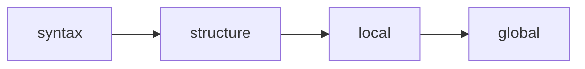

# 质量控制

Typedown 提供统一的 `check` 命令，包含四个渐进式验证阶段。每个阶段建立在前一阶段之上，允许根据当前工作流需求在速度和彻底性之间进行权衡。

## 渐进式验证

四个阶段形成管道，每个阶段都是前一阶段的超集：



### 阶段 1: Syntax

最快的检查，仅解析文件而不加载 Python 环境。

```bash
typedown check syntax
```

验证 Markdown AST 结构和 YAML 格式正确性。在活跃编辑期间使用，当你需要即时反馈语法错误时。

### 阶段 2: Structure

加载模型并实例化实体，但不运行验证器。

```bash
typedown check structure
```

确保实体可以从其原始数据构造。这是结构完整性的轻量级检查。使用 `--fast` 标志作为 syntax 加 structure 的快捷方式。

### 阶段 3: Local

默认检查级别，对所有实体运行 Pydantic 验证器。

```bash
typedown check
typedown check local
```

执行字段验证器、模型验证器和计算字段。验证引用格式而不解析它们。确保每个实体内部一致。适合编辑器中的保存前验证。

### 阶段 4: Global

完整的项目验证，包括跨实体引用解析和 spec 执行。

```bash
typedown check global
typedown check --full
```

解析所有引用以验证它们指向存在的实体。运行 spec 块进行复杂的跨实体规则验证。在提交和构建前使用。`--full` 标志运行所有阶段。

## 环境隔离

不同阶段适用于不同环境：

**编辑器集成**: 使用 `syntax` 和 `local` 检查。这些是纯本地操作，响应时间为毫秒级，可安全实时执行。

**提交前**: 使用 `global` 或 `--full` 检查。确保整个项目在提交更改前内部一致。

**持续集成**: 将 `global` 检查作为强制门禁。可选择运行自定义脚本进行外部验证。

## 外部验证

对于需要外部服务的检查，在 Front Matter 或项目配置中定义自定义脚本：

```yaml
scripts:
  verify-external: 'python scripts/check_api.py --entity ${entity.id}'
```

执行方式：

```bash
typedown run verify-external
```

这些脚本可能调用外部 API、查询数据库或执行其他有副作用的操作。仅在受信任的环境如 CI/CD 流水线中运行它们。

## 构建脚本

产物生成通过脚本系统处理：

```yaml
scripts:
  build: 'python scripts/generate_schema.py && python scripts/export_sql.py'
```

执行方式：

```bash
typedown run build
```

构建脚本应是幂等的，通常需要先通过完整检查。
