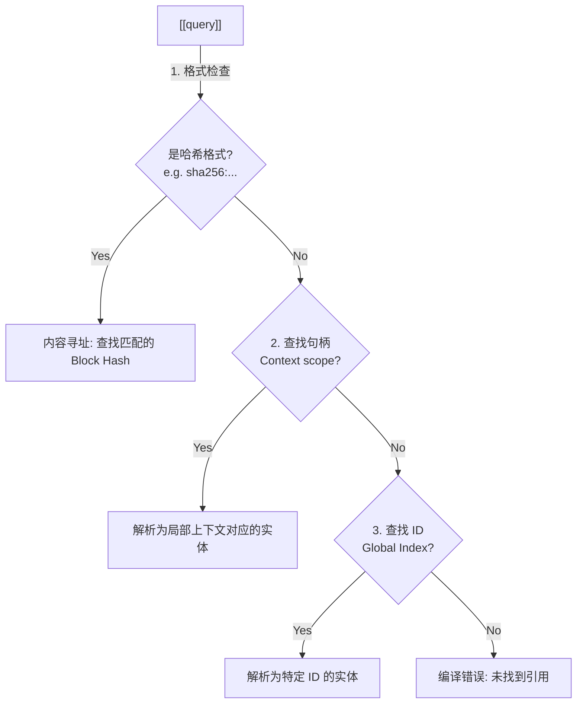

# 引用 (References)

在 Typedown 中，引用是连接孤立实体的神经突触。我们使用双中括号 `[[ ]]` 作为统一的引用语法。

## 1. 核心理念：引用即查询 (Reference as Query)

我们需要重构对 `[[...]]` 的传统认知：**它不代表一个绝对的物理地址（Addressing），也不仅仅是一个指针**。

**`[[query]]` 代表一个“查询意图”**。

当写下 `[[alice]]` 时，你实际上是在对编译器说：_"请在当前上下文中，找到最可能被称作 alice 的那个东西"_。

这种设计是为了服务于**认知的渐进形式化**：

- 在早期草稿中，`[[alice]]` 可能只是一个模糊的指代。
- 随着系统演进，编译器会通过**三重解析**机制，将其逐渐坍缩为精确的单一实体。
- 这种**模糊性 (Ambiguity)** 是 Typedown 的核心特性，它允许人类以符合直觉的方式书写，而将精确匹配的重担交给工具链。

若需要绝对精确，你应该通过更准确的 Query String（如完整的 Hash 或 Global ID）来主动减少歧义。

## 2. 核心机制：三重解析 (Triple Resolution)

为了实现上述“最佳匹配”逻辑，`[[query]]` 的解析遵循严格的优先级链：



1. **哈希引用 (Hash Ref)**: 如果查询字符串符合哈希格式（如 `sha256:xx` 或长 Hex），则忽略所有上下文，直接通过 **CAS (内容寻址存储)** 定位特定的不可变快照。这是**完全精确**的。
2. **句柄引用 (Handle Ref)**: 查找当前上下文（Context）中定义的变量名。这是实现“依赖注入”的关键。
3. **ID 引用 (ID Ref)**: 尝试直接在全局索引中匹配 Logical ID。这是**全局唯一**的。

## 3. 内容寻址 (Content Addressing)

Typedown 支持基于内容的哈希引用。这使得引用可以指向一个**确定性**的数据快照，而非可变的实体。

### 计算逻辑

哈希值由 Entity 代码块的 **规范化 Body (Canonical Body)** 计算得出。

> 算法：`SHA-256( Trim( YAML_Content ) )`

这意味着：只要两个 Block 的有效数据内容一致（不包括 Handle、注释或格式差异），它们的 Hash 就一致。

### 语法示例

```markdown
# 引用特定版本的配置快照，无惧原 ID 被修改

base_config: [[sha256:a1b2c3d4...]]
```

## 4. 在 YAML 数据中使用

Typedown 采用 **"YAML with Sugar"** 策略。虽然标准 YAML 解析器会将 `[[ ]]` 视为嵌套列表，但 Typedown 编译器会在 AST 层面进行**智能解包 (Smart Unboxing)**。

### A. 单值引用 (Single Reference)

```yaml
# 这里的 [[leader]] 在标准 YAML 中是 ["leader"] (List<String>)
# 编译器智能转换为 Reference 对象
manager: [[leader]]
```

### B. 列表引用 (List of References)

这是最显著的语法优化。你不需要编写繁琐的嵌套列表结构。

````markdown
```entity Project: death_star
# 推荐写法 (Block Style)
contributors:
  - [[vader]]
  - [[tarkin]]

# 同时也支持 Flow Style
reviewers: [ [[emperor]], [[thrawn]] ]
```
````

**底层逻辑**:

1. YAML Parser 读取为 `[['vader'], ['tarkin']]`。
2. Typedown Validate 发现字段定义为 `List[Reference[T]]`。
3. 自动执行 Flatten 操作，转换为 `[Ref('vader'), Ref('tarkin')]`。

## 5. 类型安全 (`Reference[T]`)

在 Pydantic 模型中，使用 `Reference` 泛型来强制类型约束。

```python
from typedown.types import Reference

class Task(BaseModel):
    title: str
    # 约束: assignee 必须引用一个 User 类型的实体
    assignee: Reference["User"]
    # 约束: 也可以是多种类型之一
    subscribers: List[Reference["User", "Team"]]
```

### 编译时检查

当用户编写 YAML 时，编译器会执行三层检查：

1. **存在性 (Existence)**: `[[alice]]` 在当前作用域可见吗？
2. **类型兼容性 (Type Safety)**: `[[alice]]` 指向的是一个 `User` 吗？如果它是 `Device`，编译报错。
3. **图完整性 (Graph Integrity)**: 确保没有悬空引用 (Dangling References)。

## 6. 引用其他对象

`[[ ]]` 是通用链接语法，支持指向系统中的任何一等公民：

- **Spec**: `validates: [[check_age]]`
- **Type**: `implements: [[ProtocolA]]`
- **File**: `attachment: [[./specs/design.pdf]]`
